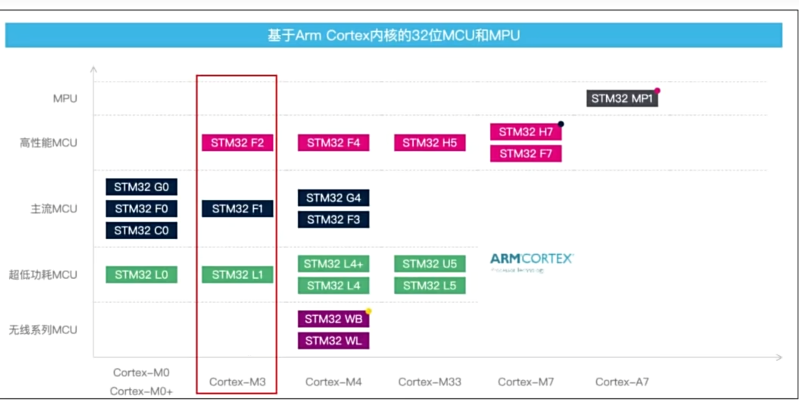
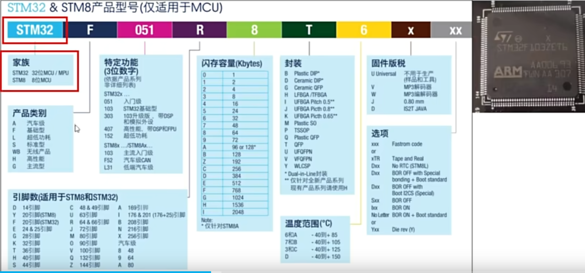

## 分类

## 命名规范

## 开发工具
`Keil MDK`+`VsCode Keil插件`----这个当`Keil MDK`这边发生更改后，一定要保存，并关掉，`VsCode`才会生效

`STM32CubeIDE`
`CLion插件`
在寄存器时候，选择Keil MDK
在进行HAL库时候，还会用到STM32CubeMX,进行图形化配置

## STM32 HAL、CubeIDE、CubeMX是STM32开发中常用的工具，它们之间存在以下区别和联系：

### 区别
- **STM32 HAL**：全称Hardware Abstraction Layer，即硬件抽象层。它是ST公司主推的STM32Cube生态系统中的器件驱动库，为STM32系列微控制器提供了一组标准的API函数，用于操作硬件外设。通过HAL库，开发者可以使用更简洁、更通用的函数来控制硬件，而无需直接操作底层寄存器。HAL库具有良好的可移植性，支持STM32全线产品。
- **CubeIDE**：是ST公司推出的一款集成开发环境，基于Eclipse和GNU C/C++等开源工具链。它集成了编译、调试、代码生成等功能，并且将STM32CubeMX集成到IDE中，使得整个软件的配置和开发更加便捷。CubeIDE支持多种工具链，如MDK、IAR For ARM、TrueStudio等。
- **CubeMX**：是一个图形化的配置工具，用于STM32微控制器的外设配置和初始化代码生成。通过图形化界面，开发者可以轻松地配置GPIO、时钟树、外设等，并生成相应的C语言初始化代码。CubeMX支持多种IDE，如MDK、IAR For ARM、TrueStudio等，并且可以生成多种IDE软件的项目框架。

### 联系
- **CubeMX与HAL**：CubeMX是为HAL库设计的配套工具，它生成的初始化代码是基于HAL库的。开发者可以使用CubeMX快速配置外设，并生成HAL库的初始化代码，从而提高开发效率。
- **CubeIDE与HAL**：CubeIDE支持HAL库的开发，开发者可以在CubeIDE中使用HAL库提供的API函数来编写应用程序。同时，CubeIDE也集成了HAL库的调试功能，方便开发者进行调试和优化。
- **CubeIDE与CubeMX**：CubeIDE将CubeMX集成到其环境中，使得开发者可以在同一个IDE中完成外设配置和代码生成。这样，开发者可以更加方便地进行项目开发，提高开发效率。