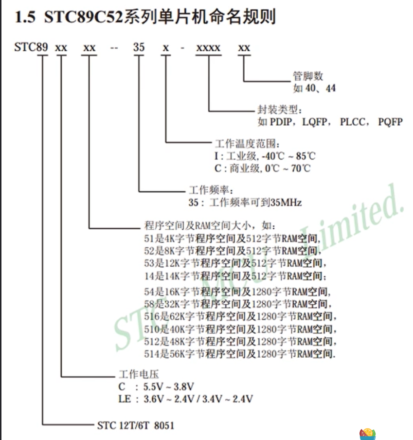
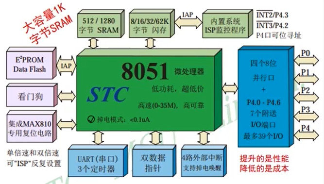
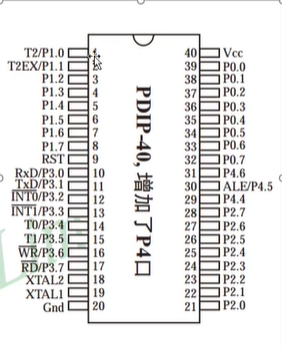
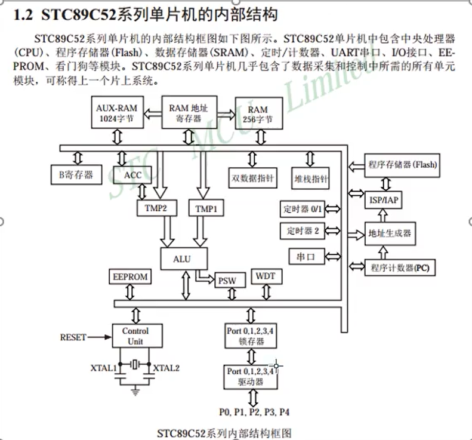
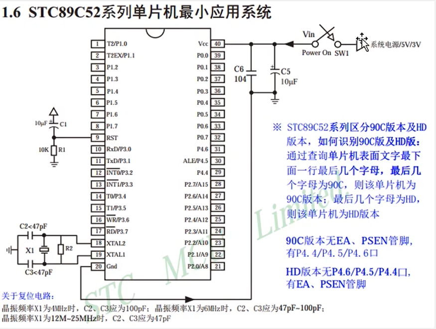
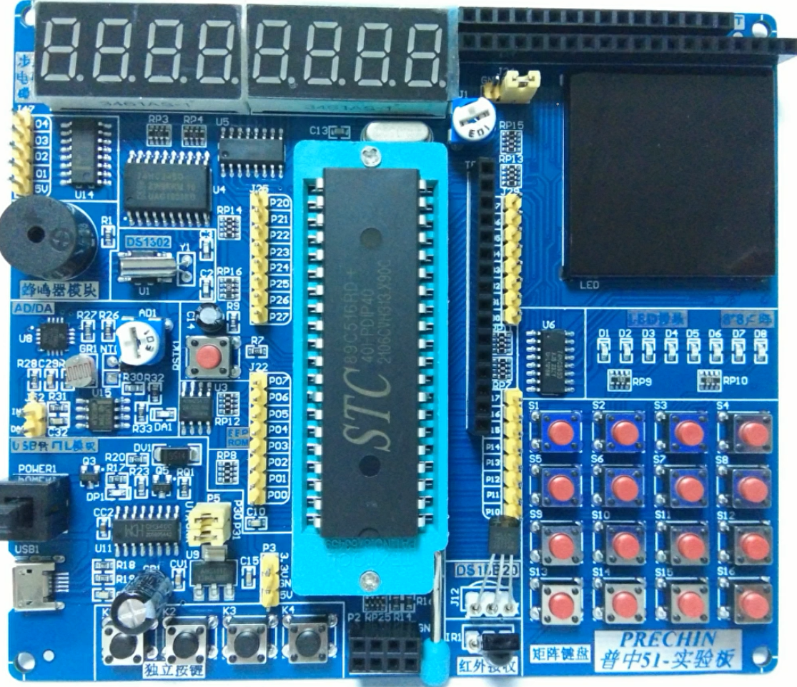
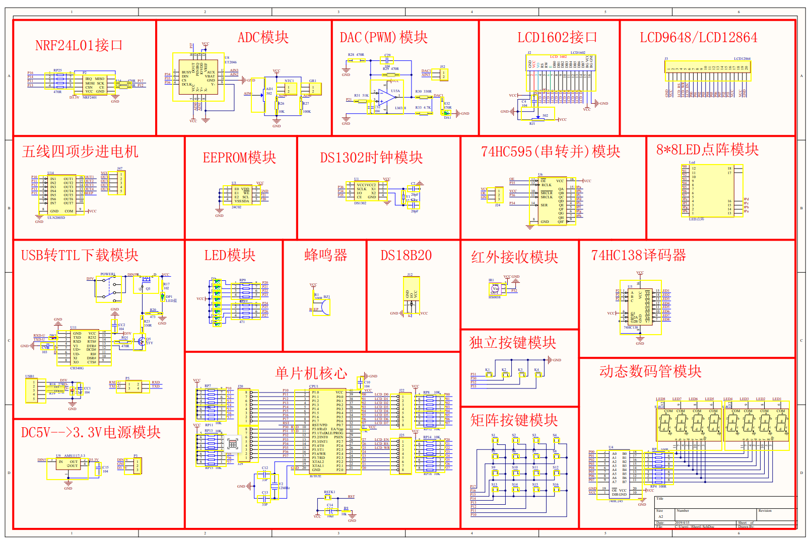
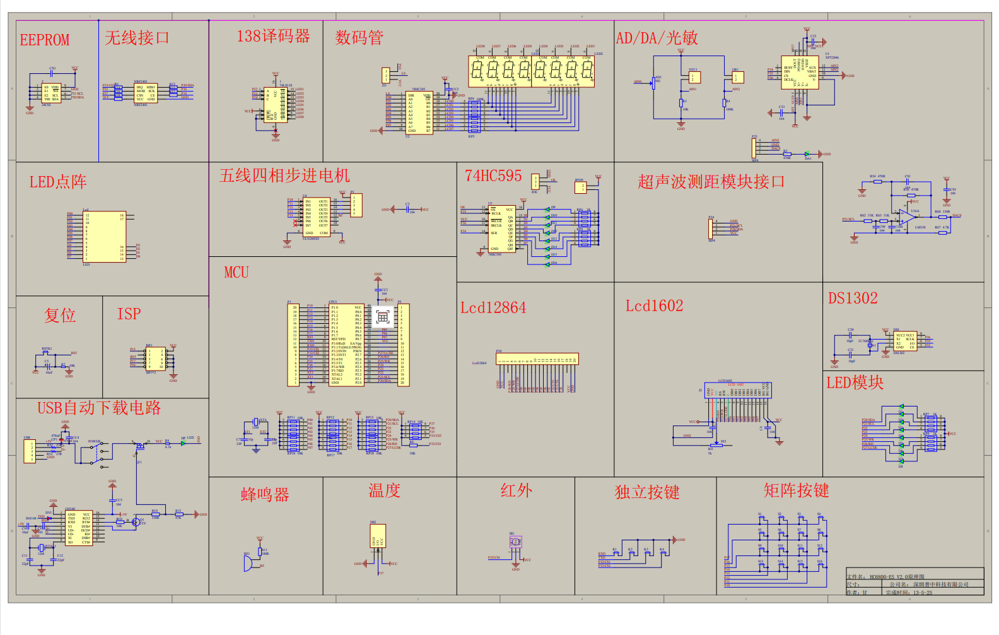

# Micro Controller Unit, MCU 单片机
Micro Controller Unit, MCU 单片机，其中包含了CPU RAM ROM 输入输出设备 等一系列电脑硬件常用功能。

功能：通过传感器采集数据，通过CPU处理数据，控制硬件。

可以说是一个性能低的小电脑，是了解计算机原理的很好的学习方法。

右上角的跳线帽使用数码管时跳到VCC，使用点阵时跳到GND。

# STC89C52RC 命名规则
STC：芯片为 STC 公司生产的产品。

8：该芯片为 8051 内核芯片。

9：表示内部含有 Flash EEPROM 存储器，还有如 80C51 中 0 表内部含有 MaskROM（掩模 ROM）存储器；如 87C51 中 7 表示内部含有 EPROM（紫外线可擦除 ROM）存储器。

C–表示该器件为 CMOS 产品。还有如 89LV52 和 89LE58 中的 LV 和 LE 都表示 该芯片为低电压产品（通常为 3.3V 电压供电）；而 89S52 中 S 表示该芯片含有 可串行下载功能的 Flash 存储器，即具有 ISP 可在线编程功能。

5–固定不变。

2：表示该芯片内部程序存储（FLASH）空间大小，1 为 4KB，2 为 8KB，3 为 12KB，即该数乘以 4KB 就是芯片内部的程序存储空间大小。程序空间大小决定了 一个芯片所能装入执行代码的多少。一般来说，程序存储空间越大，芯片价格也 越高，所以我们再选择芯片的时候要根据自己需求选择合适芯片。 RC–STC 单片机内部 RAM（随机读写存储器）为 512B。还有如 RD+表示内部 RAM 为 1280B。还有芯片会省略此部分


# 中间芯片介绍
芯片在 PDIP 里。黑色的部分 PDIP 是一种封装方式，可能还有 LQFP 等（一个正方形的形状）封装方式。

8051 内核基本上都是中间绿色块的样子，只是外设、封装等方式不同。



## 管脚图：
Vcc 是电源，XTAL 管时钟，RST 是复位，等等。


## 详细结构
- 整个是一个总线结构，所有外设都挂在上面。如最下面一行左边是晶振，右边是外部引脚


- 只有这一个单片机是不能运行的，看我们的开发板上面还外接了好多好多外设呢。能让单片机运行的最小应用系统如下：

```
  - 三角是正极，三线符号是负极。
  - 首先需要 Vcc 接正，GND 接负。
  - 然后需要接晶振。没有晶振,单片机程序无法一条条往下执行，有了晶振按照固定的周期才能一条条往下执行。晶振就是板子上银色的椭圆形的一个东西，频率写在上面，一般是有12MHz和11.多MHz的两种（有的芯片自带晶振。不过很明显我们的芯片并不自带）。
  - 然后还有复位电路，让程序回到第一条的位置。
```
# 开发板介绍


```
中间黑色的是刚刚介绍的单片机。拉起拉杆，可以取下单片机，但放回时一定不能放反。单片机有缺口的一端左侧从01开始，逆时针逐渐增大到40。

右侧中间有8个 LED 灯，我是点灯大师！

下面是一个矩阵按键，用户可以通过按按键输入。

最下面一行右侧有个红外接收传感器，接收红外线的。

左边无线模块，8个插孔的，做无线模块（如2.4G）用的。

再左边四个独立按键。

最左下是 USB 自动下载模块，插上 USB 线后按开关就会自动下载程序，不用了解。

DS1302 时钟芯片，可以做一个小时钟，读取时间。

红色按钮是 RST 按钮。

AD/DA 模数转换器，使单片机在数字与模拟领域之间转化。

74H595 可以扩展出更多的 IO 口。

步进电机可以精确控制脚步（转一圈、转半圈）。比如空调会用。

超声波模块可以测距。

蜂鸣器模块可以放歌。但我（）（）（）（）。

138译码器控制数码管，也可以扩展 IO 口。

24c02 也是一种 ROM，还是 EEP ROM（掉电不丢失）。其实单片机自带的 Flash ROM 更先进，但是只能用来存储程序。

温度传感器可以用来检测温度。

74HC245 可以驱动数码管（我的单片机是 HC138）。

左上角的电位器和排座用于接显示屏。电位器可以调整显示屏的亮度。

最大的黑色方阵是一个 LED 点阵。可以点亮8*8的方阵，甚至用来做动画。
```

# PCB
`A2`

`HC6800-ES+V2.0`

