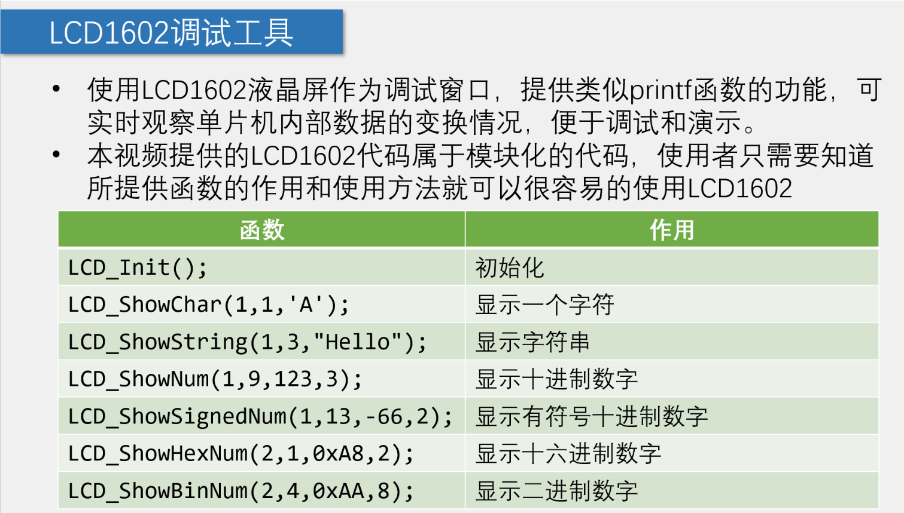

调试还有串口，数码管等。LCD1602比较方便
- 比如数码管扫描不及时会闪烁，并且显示内容比较少
- 可以通过串口把数据放到电脑上观察，需要不断打开



## LCD1602模块
`src/LCD1602.h`
```c
#ifndef __LCD1602_H__
#define __LCD1602_H__

//用户调用函数：
void LCD_Init();
void LCD_ShowChar(unsigned char Line,unsigned char Column,char Char);
void LCD_ShowString(unsigned char Line,unsigned char Column,char *String);
void LCD_ShowNum(unsigned char Line,unsigned char Column,unsigned int Number,unsigned char Length);
void LCD_ShowSignedNum(unsigned char Line,unsigned char Column,int Number,unsigned char Length);
void LCD_ShowHexNum(unsigned char Line,unsigned char Column,unsigned int Number,unsigned char Length);
void LCD_ShowBinNum(unsigned char Line,unsigned char Column,unsigned int Number,unsigned char Length);

#endif
```
`src/LCD1602.c`
```c
#include <REG52.H>

//引脚配置：
sbit LCD_RS=P2^6;
sbit LCD_RW=P2^5;
sbit LCD_EN=P2^7;
#define LCD_DataPort P0

//函数定义：
/**
  * @brief  LCD1602延时函数，12MHz调用可延时1ms
  * @param  无
  * @retval 无
  */
void LCD_Delay()
{
	unsigned char i, j;

	i = 2;
	j = 239;
	do
	{
		while (--j);
	} while (--i);
}

/**
  * @brief  LCD1602写命令
  * @param  Command 要写入的命令
  * @retval 无
  */
void LCD_WriteCommand(unsigned char Command)
{
	LCD_RS=0;
	LCD_RW=0;
	LCD_DataPort=Command;
	LCD_EN=1;
	LCD_Delay();
	LCD_EN=0;
	LCD_Delay();
}

/**
  * @brief  LCD1602写数据
  * @param  Data 要写入的数据
  * @retval 无
  */
void LCD_WriteData(unsigned char Data)
{
	LCD_RS=1;
	LCD_RW=0;
	LCD_DataPort=Data;
	LCD_EN=1;
	LCD_Delay();
	LCD_EN=0;
	LCD_Delay();
}

/**
  * @brief  LCD1602设置光标位置
  * @param  Line 行位置，范围：1~2
  * @param  Column 列位置，范围：1~16
  * @retval 无
  */
void LCD_SetCursor(unsigned char Line,unsigned char Column)
{
	if(Line==1)
	{
		LCD_WriteCommand(0x80|(Column-1));
	}
	else if(Line==2)
	{
		LCD_WriteCommand(0x80|(Column-1+0x40));
	}
}

/**
  * @brief  LCD1602初始化函数
  * @param  无
  * @retval 无
  */
void LCD_Init()
{
	LCD_WriteCommand(0x38);//八位数据接口，两行显示，5*7点阵
	LCD_WriteCommand(0x0c);//显示开，光标关，闪烁关
	LCD_WriteCommand(0x06);//数据读写操作后，光标自动加一，画面不动
	LCD_WriteCommand(0x01);//光标复位，清屏
}

/**
  * @brief  在LCD1602指定位置上显示一个字符
  * @param  Line 行位置，范围：1~2
  * @param  Column 列位置，范围：1~16
  * @param  Char 要显示的字符
  * @retval 无
  */
void LCD_ShowChar(unsigned char Line,unsigned char Column,char Char)
{
	LCD_SetCursor(Line,Column);
	LCD_WriteData(Char);
}

/**
  * @brief  在LCD1602指定位置开始显示所给字符串
  * @param  Line 起始行位置，范围：1~2
  * @param  Column 起始列位置，范围：1~16
  * @param  String 要显示的字符串
  * @retval 无
  */
void LCD_ShowString(unsigned char Line,unsigned char Column,char *String)
{
	unsigned char i;
	LCD_SetCursor(Line,Column);
	for(i=0;String[i]!='\0';i++)
	{
		LCD_WriteData(String[i]);
	}
}

/**
  * @brief  返回值=X的Y次方
  */
int LCD_Pow(int X,int Y)
{
	unsigned char i;
	int Result=1;
	for(i=0;i<Y;i++)
	{
		Result*=X;
	}
	return Result;
}

/**
  * @brief  在LCD1602指定位置开始显示所给数字
  * @param  Line 起始行位置，范围：1~2
  * @param  Column 起始列位置，范围：1~16
  * @param  Number 要显示的数字，范围：0~65535
  * @param  Length 要显示数字的长度，范围：1~5
  * @retval 无
  */
void LCD_ShowNum(unsigned char Line,unsigned char Column,unsigned int Number,unsigned char Length)
{
	unsigned char i;
	LCD_SetCursor(Line,Column);
	for(i=Length;i>0;i--)
	{
		LCD_WriteData(Number/LCD_Pow(10,i-1)%10+'0');
	}
}

/**
  * @brief  在LCD1602指定位置开始以有符号十进制显示所给数字
  * @param  Line 起始行位置，范围：1~2
  * @param  Column 起始列位置，范围：1~16
  * @param  Number 要显示的数字，范围：-32768~32767
  * @param  Length 要显示数字的长度，范围：1~5
  * @retval 无
  */
void LCD_ShowSignedNum(unsigned char Line,unsigned char Column,int Number,unsigned char Length)
{
	unsigned char i;
	unsigned int Number1;
	LCD_SetCursor(Line,Column);
	if(Number>=0)
	{
		LCD_WriteData('+');
		Number1=Number;
	}
	else
	{
		LCD_WriteData('-');
		Number1=-Number;
	}
	for(i=Length;i>0;i--)
	{
		LCD_WriteData(Number1/LCD_Pow(10,i-1)%10+'0');
	}
}

/**
  * @brief  在LCD1602指定位置开始以十六进制显示所给数字
  * @param  Line 起始行位置，范围：1~2
  * @param  Column 起始列位置，范围：1~16
  * @param  Number 要显示的数字，范围：0~0xFFFF
  * @param  Length 要显示数字的长度，范围：1~4
  * @retval 无
  */
void LCD_ShowHexNum(unsigned char Line,unsigned char Column,unsigned int Number,unsigned char Length)
{
	unsigned char i,SingleNumber;
	LCD_SetCursor(Line,Column);
	for(i=Length;i>0;i--)
	{
		SingleNumber=Number/LCD_Pow(16,i-1)%16;
		if(SingleNumber<10)
		{
			LCD_WriteData(SingleNumber+'0');
		}
		else
		{
			LCD_WriteData(SingleNumber-10+'A');
		}
	}
}

/**
  * @brief  在LCD1602指定位置开始以二进制显示所给数字
  * @param  Line 起始行位置，范围：1~2
  * @param  Column 起始列位置，范围：1~16
  * @param  Number 要显示的数字，范围：0~1111 1111 1111 1111
  * @param  Length 要显示数字的长度，范围：1~16
  * @retval 无
  */
void LCD_ShowBinNum(unsigned char Line,unsigned char Column,unsigned int Number,unsigned char Length)
{
	unsigned char i;
	LCD_SetCursor(Line,Column);
	for(i=Length;i>0;i--)
	{
		LCD_WriteData(Number/LCD_Pow(2,i-1)%2+'0');
	}
}

```
> 使用这些代码来验证LCD1602函数以及显示屏的使用：
`src/main.c`
```c
#include "REG52.H"
#include "LCD1602.h"

void main(){
    
    // 初始化
    LCD_Init();
    
    //1行1列显示字符c
    LCD_ShowChar(1, 1, 'c');
    //1行3列显示长度为3的字符串CZQ
    LCD_ShowString(1, 3, "CZQ");
    // 1行7列显示长度为3的数字456
    LCD_ShowNum(1, 7, 456, 3);
    // 1行11列显示长度为4的无符号数字-2877
    LCD_ShowSignedNum(1, 11, -2877, 4);
    // 将十进制转化为十六进制 65535转化为FFFF，长度为4，所以显示FFFF
    LCD_ShowHexNum(2, 1, 65535, 4);
    // 也可以直接显示十六进制数 十六进制AF转化为十六进制为AF，显示长度为4，所以是00AF
    LCD_ShowHexNum(2, 6, 0xAF, 4);
    // 将十进制转化为二进制 十进制5转化为二进制为101，显示长度为4，所以为0101
    LCD_ShowBinNum(2, 11, 5, 4);
    
    while (1)
    {   
        
    }
    
}
```
> 使用之前封装好的Delay函数来查看显示屏的实时刷新
`src/main.c`
```c
#include "REG52.H"
#include "Delay.h"

int result = 0;

void main(){
    
    // 初始化
    LCD_Init();
    
    while (1)
    {   
        result++;
        Delay(1000);
        // 1行1列从000开始，每隔1s加一，显示屏会实时刷新
        LCD_ShowNum(1, 1, result, 3);
    }
    
}
```