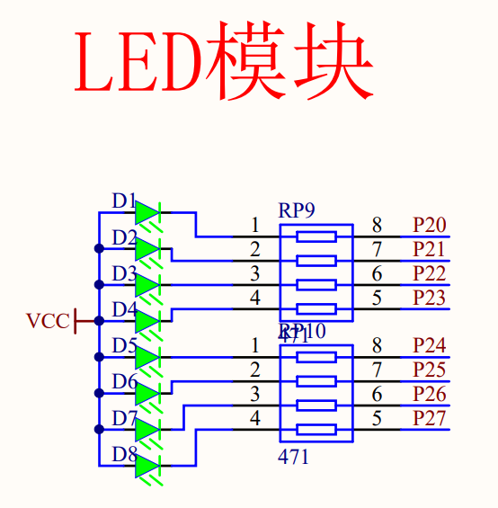
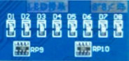
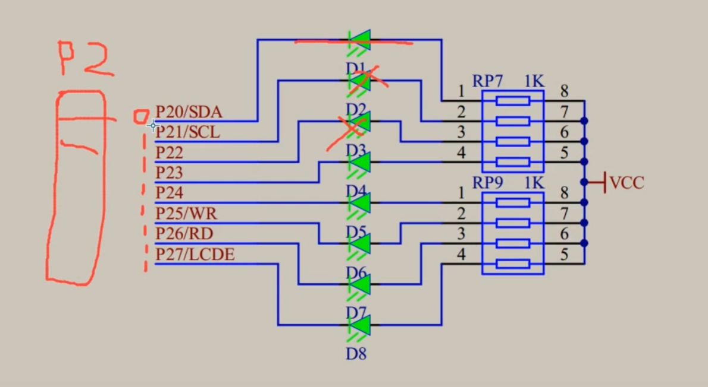
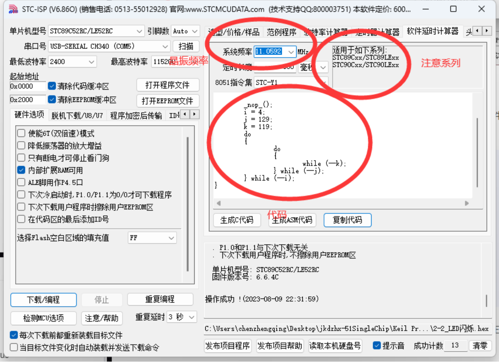

# LED模块综述


- 下面两个黑色的方块就是8个电阻。电阻是限流作用，防止电流过大烧毁 LED。电阻上面写着小小的“102”，代表10*10^2，即1kΩ。
- 每个 LED 正极是一定通电流的，如果负极接地，那么这个 LED 被点亮。否则两头都是高电平点不亮（这里的电平是 TTL 电平，高5低0）。
- 单片机如何驱动高低电平？在 MCU 内，CPU 接到指令（如P2^0口赋1，即高电平）CPU 把数据写入寄存器，寄存器数据通过驱动器放大后变为5V/0V 电平输出。


## 延时处理
单片机频率单位是 MHz 兆赫兹，所以只是单纯的亮灭亮灭肉眼看不出亮灭的效果。所以需要延时。

- 延时可以写一个这样的函数：
```c
typedef unsigned int u16
void delay(u16 ten_us){
    while(ten_us--);
}

/*
u16 代表16位的无符号整型数据。这是一个比较常用的定义，unsigned char 定义为 u8, unsigned int 定义为 u16。当 ten_us 超出 u16 的范围后，跳出 while 循环。
*/
```
- STC-ISP 可以根据晶振频率和要延时的时间生成延时函数，真的牛！不过注意软件上标明的适用系列版本。


通过stc生成的代码：（需要添加一个头文件，下面将会说出来）
其中` _nop_()` 函数包括在 `INTRINS.H` 头文件中，是一个空语句，就只会产生延时的效果
```c
void Delay500ms()		//@11.0592MHz
{
	unsigned char i, j, k;

	_nop_(); //
	i = 4;
	j = 129;
	k = 119;
	do
	{
		do
		{
			while (--k);
		} while (--j);
	} while (--i);
}
```
- 如果我们想要200ms延迟、1000ms、2000ms等其他自定义延迟呢？——我们可以通过对Delay函数入手，通过控制形参实现

stc软件生成的延时1ms函数：
```c
void Delay1ms()		//@11.0592MHz
{
	unsigned char i, j;

	_nop_();
	i = 2;
	j = 199;
	do
	{
		while (--j);
	} while (--i);
}
```
定义形参，选定的修饰符为 `unsigned int`
这里使用了循环，传入的是我们的形参，每执行一次循环就会将形参-1 也就是意味着延时1*time毫秒会退出循环
```c
/**
 * @description: 初始延时1ms函数由stc工具生成，最后自己封装的延时函数，可以传参
 * @param {unsigned int} time 延时的时间 单位为ms，最后的延时应该为1*time毫秒
 * @return {*}
 */
// 在C语言中，int类型表示0~2^16-1个数 其中次方是单片机所支持的16位 换算成二进制，最高表示位应该是 1111 1111 1111 1111
// unsigned表示不需要考虑数字前面的正负号 所以unsigned表示的是非负数
void Delay(unsigned int time) //@11.0592MHz
{
    unsigned char i, j;

    while (time) {
        _nop_();
        i = 2;
        j = 199;
        do {
            while (--j)
                ;
        } while (--i);

        // 这里如果不减一的话就会一直执行while，也就意味着下一个灯不会亮
        // 这里执行1*time毫秒结束循环 就可以实现控制形参来控制循环了
        time--;
    }
}
```
`完整代码`
```c
#include <REG52.H>
#include <INTRINS.H> //定义nop函数的头文件

/**
 * @description: 初始延时1ms函数由stc工具生成，最后自己封装的延时函数，可以传参
 * @param {unsigned int} time 延时的时间 单位为ms，最后的延时应该为1*time毫秒
 * @return {*}
 */
// 在C语言中，int类型表示0~2^16-1个数 其中次方是单片机所支持的16位 换算成二进制，最高表示位应该是 1111 1111 1111 1111
// unsigned表示不需要考虑数字前面的正负号 所以unsigned表示的是非负数
void Delay(unsigned int time) //@11.0592MHz
{
    unsigned char i, j;

    while (time) {
        _nop_();
        i = 2;
        j = 199;
        do {
            while (--j)
                ;
        } while (--i);

        // 这里如果不减一的话就会一直执行while，也就意味着下一个灯不会亮
        // 这里执行1*time毫秒结束循环 就可以实现控制形参来控制循环了
        time--;
    }
}

void main()
{

    while (1) {
        P2 = 0xFE; // 1111 1110
        Delay(200);
        P2 = 0xFD; // 1111 1101
        Delay(200);
        P2 = 0xFB; // 1111 1011
        Delay(200);
        P2 = 0xF7; // 1111 0111
        Delay(200);
        P2 = 0xEF; // 1110 1111
        Delay(200);
        P2 = 0xDF; // 1101 1111
        Delay(200);
        P2 = 0xBF; // 1011 1111
        Delay(2000);
        P2 = 0x7F; // 0111 1111
        Delay(1000);
    }
}
```