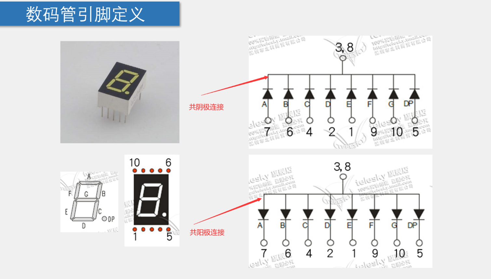
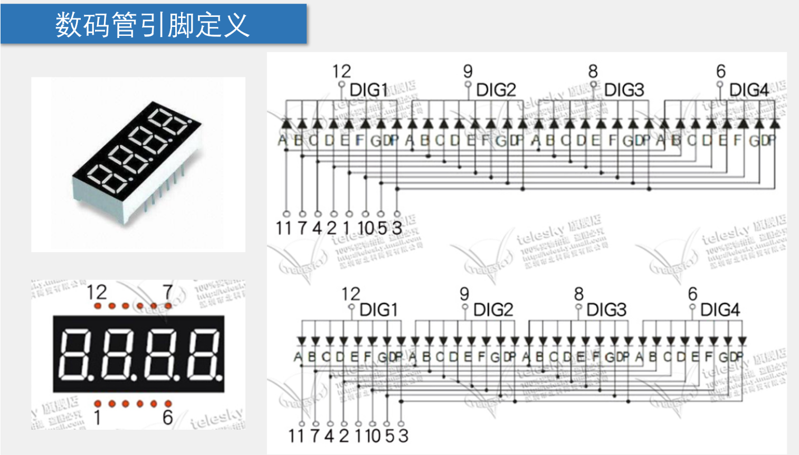
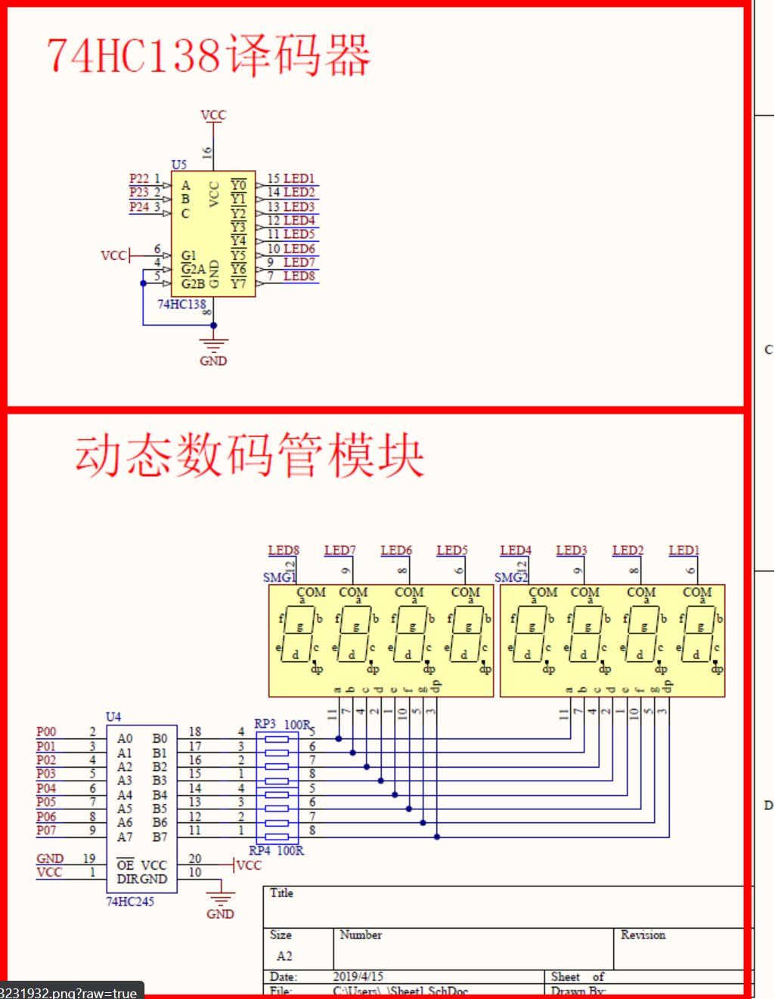
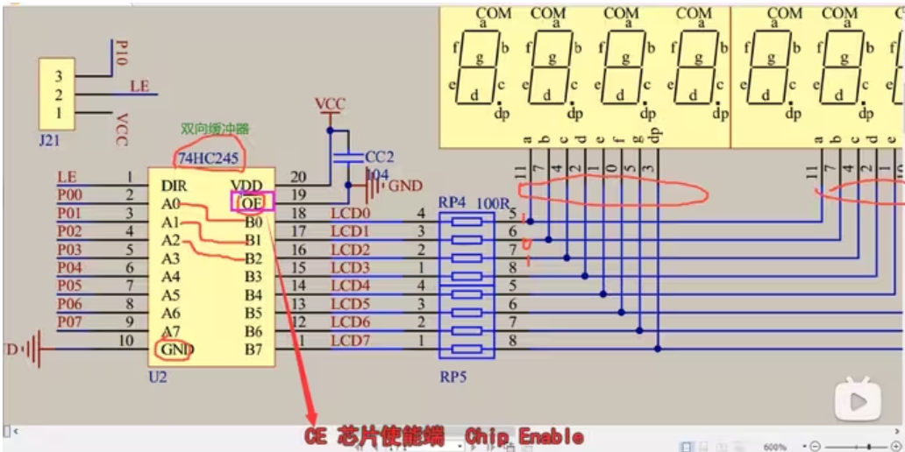

## 1位数码管的连接管脚图

在这幅图里，A~G和一个字节的八位相对应，这样看虽然有点杂乱，但是每个引脚引出都是遵循“就近原则”的

举例：我们要在数码管显示数字”6“

​那我们需要把AFEDCG段点亮：
```	md
* 上面的共阴极接法图中，我们规定3,8端接地，所以我们要在A~DP段输入高电平才能连通（产生电势差），数码管段才会亮，所以输入的段码应该是：10111110，这8个数据发送给单片机的IO口，即可显示“6”
* 在对应共阳极接法图中，我们规定3,8端接VCC电源，然后在A~DP段输入01000001（和共阴极的段码相反）
```
## 四位一体数码管
四个大公共端引出，其余字母相同的管子连在一块，比如所有数码管的A段连在一块，B段连在一块：


## 接下来我们看一看和数码管组所连接的两个译码器：


### 138译码器
```
左上角的输入口ABC是从低到高位排下来的，我们正常应该按照CBA来读

左下角是使能端的连接，目的是让它能工作，给100就可以让这个芯片工作了（了解就好，实际开发不用管）

右边的是控制输出的8个口，分别位选口连接着每一个LED灯，它们都是共阴极的连接

通过给CBA三个输入端口二进制数字0和1来选择转换二进制之后的输出端口（转换成数字几久控制Y几），每个Y头上的“—”这一横是代表低电平有效（即给0）
```

### 245译码器
245这个译码器的作用是双向缓冲，由于低电平驱动就会让电路的驱动效果更好，例如我们在做LED亮灯的时候，使用的是低电平驱动，灯会比高电平驱动更亮一些，所以就会这样来一个缓冲（我们就理解为直接连通就好）（图标记的位置可能和A2开发板不一样，但引脚和原理是一样的


## LED 数码管模块化编程NixieControl:
`src/NixieControl.c`
```c
// 任何自定义变量、函数在调用前必须有定义或声明（.c）
#include "REG52.H"
#include "Delay.h"

// 存放着所有数码管的段数数组，由从上到下数（高位到低位）出的二进制转化为十进制，最后的0x00是什么都不显示
unsigned char NixieTable[] = {
    0x3F, 0x06, 0x5B, 0x4F, 0x66, 0x6D, 0x7D, 0x07, 0x7F, 0x6F, 0x00
};


/**
 * @description: 控制数码管显示封装的函数
 * @param {unsigned char} lotationSelect 左上角位选端，选中从左到右第几个数码管
 * @param {unsigned char} displayNum 点亮的段数
 * @return {*}
 */
void NixieControl(unsigned char lotationSelect, unsigned char displayNum){
    switch (lotationSelect)
    {
    case 1:
        // 对应的是Y7：
        P2_4 = 1; P2_3 = 1; P2_2 = 1;
        break;
    case 2:
        // 对应的是Y6
        P2_4 = 1; P2_3 = 1; P2_2 = 0;
        break;
    case 3:
        // Y5
        P2_4 = 1; P2_3 = 0; P2_2 = 1;
        break;
    case 4:
        // Y4
        P2_4 = 1; P2_3 = 0; P2_2 = 0;
        break;
    case 5:
        // Y3
        P2_4 = 0; P2_3 = 1; P2_2 = 1;
        break;
    case 6:
        // Y2
        P2_4 = 0; P2_3 = 1; P2_2 = 0;
        break;
    case 7:
        // Y1
        P2_4 = 0; P2_3 = 0; P2_2 = 1;
        break;
    case 8:
        // Y0
        P2_4 = 0; P2_3 = 0; P2_2 = 0;
        break;
    }
    P0 = NixieTable[displayNum];
    Delay(1);
    // 由于数码管是直接使用单片机扫描，会有串口冲突，所以我们在每次对数码管进行修改之后，将段数全部熄灭
    P0 = 0x00;
}
```
`src/NixieControl.h`
```c
#ifndef __NIXIECONTROL_H__
#define __NIXIECONTROL_H__

void NixieControl(unsigned char lotationSelect, unsigned char displayNum);

#endif
```