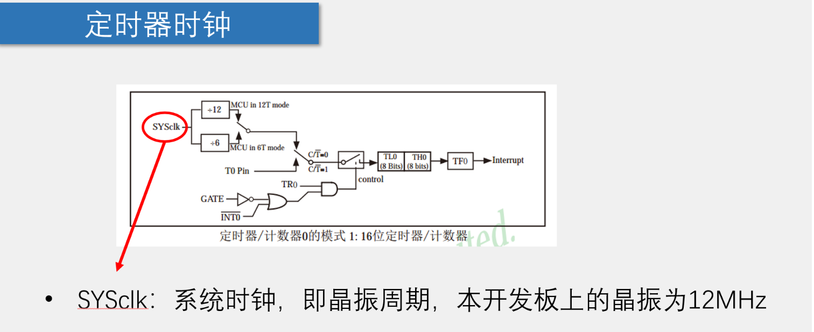

## 定时器

- 还有其他用途：进行多任务切换，多任务同时执行。
## 定时器资源

## 定时器框图---工作原理

## 定时器工作模式

- 框图中间为计数系统（此处为16位） TL和TH两个一起最大只能存65535（1111 1111 1111 1111），溢出时会将标志位TF0置1，然后向系统申请中断
## 定时器时钟

- 默认12T的模式会分频，输出位1MHz，那么此时的线路则会每隔1us计数一次；C/T是一个选择开关，配置为1时为计数功能(count)，配置为0时为定时器(timer)；本节配置为实现定时器功能
- 时钟也可以由系统提供，也可以由外部引脚提供，如下图

## 定时器中断

## 定时器中断资源

## 定时器和中断系统

## 定时器和寄存器--定时器和计数器的相关寄存器以及中断寄存器

- 电路的连接依靠于定时器相关寄存器
- 单片机通过**配置寄存器**来控制内部线路的连接，开关拨到哪个位置就是靠寄存器控制的