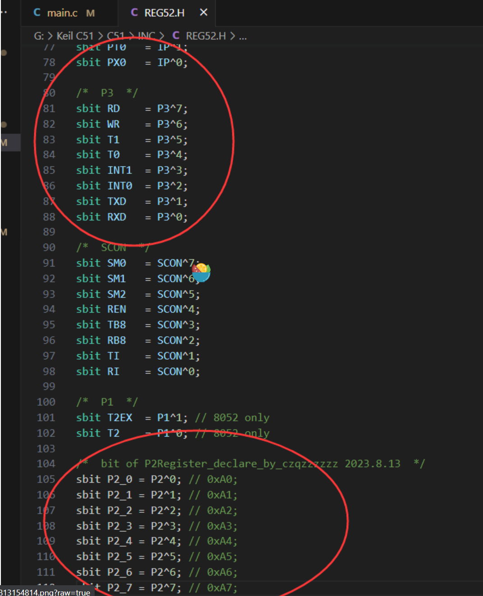
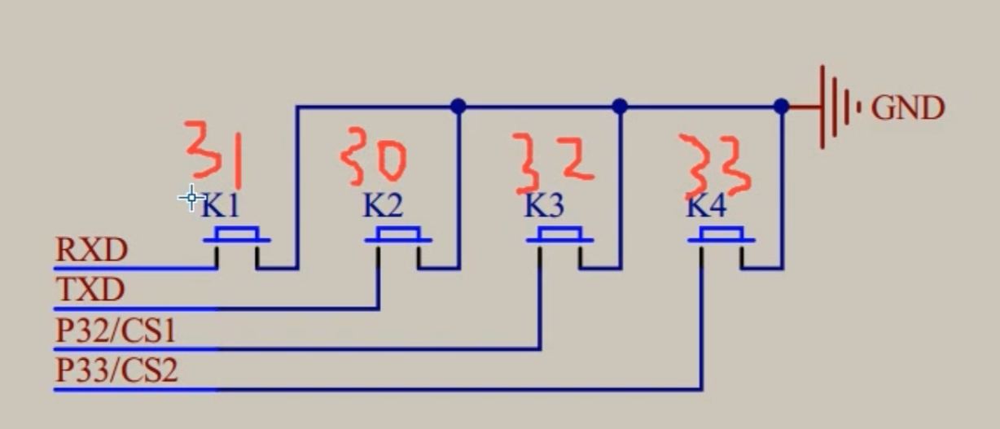
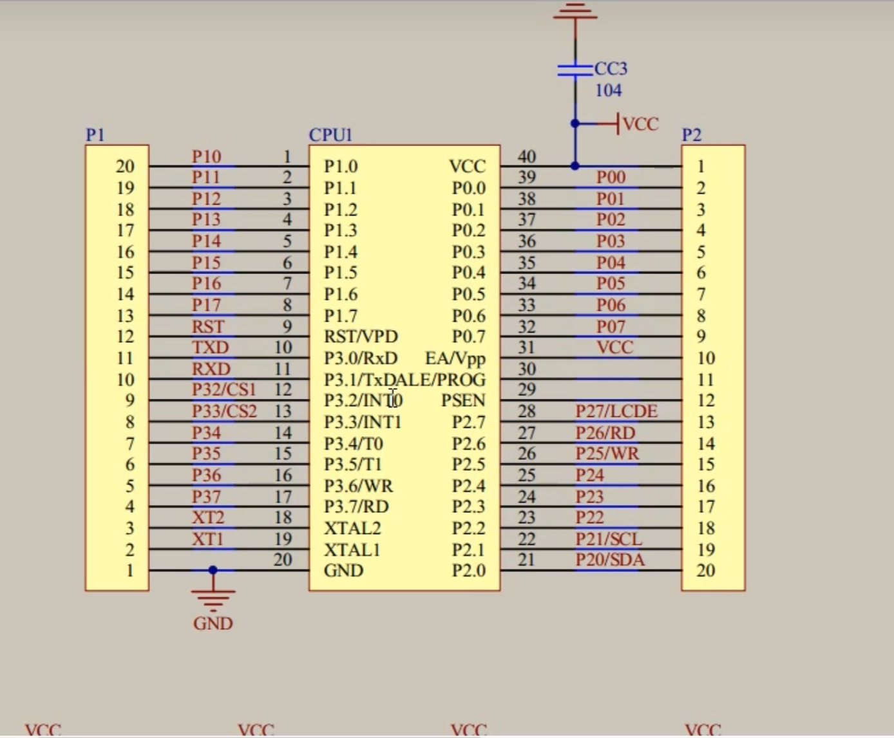

```md
* 单片机和外设之间有一个寄存器，程序所写的基本上是在操作寄存器里面的数据
* 单片机通电的时候，所有IO口默认都是高电平的1状态
* 寄存器每写一个值，就会送到IO口上，这也同样会检测IO口的电平返回值读出来
* 我们这里要实现的是，按下按键，寄存器应该读出低电平的0，松开时返回的值应该是高电平的1，这样就可以实现按键控制我们的LED灯电平了
```

> 我们在前面`P2 = 0xFE`语句其实是控制一整个`LED寄存器`实现的，寄存器8位为一组，如果我们控制一整个P2寄存器，则需要同时给8个位复制，但是我们这里只想操作具体位的LED灯，有什么办法实现呢？

> 这个时候我们可以打开头文件，找到对应寄存器的声明了，我这里的`REG52.H`头文件没有对P2寄存器和具体的位进行声明，我们这里可以使用`sbit`关键字来模仿其他寄存器进行位声明：



## 按键抖动
* 对于我们的机械开关，当机械触点断开、闭合时，由于机械触点的弹性作用，一个开关在闭合的时候不会马上稳定地接通，相应的，在断开的时候也不会一下子就断开，所以在开关闭合以及断开的一瞬间会伴随着一连串的抖动
* 硬件消抖：通过电=电路过滤掉
* 软件处理：按键按下的时候延时发生延时，松手的时候也发生延时

## 硬件对应




