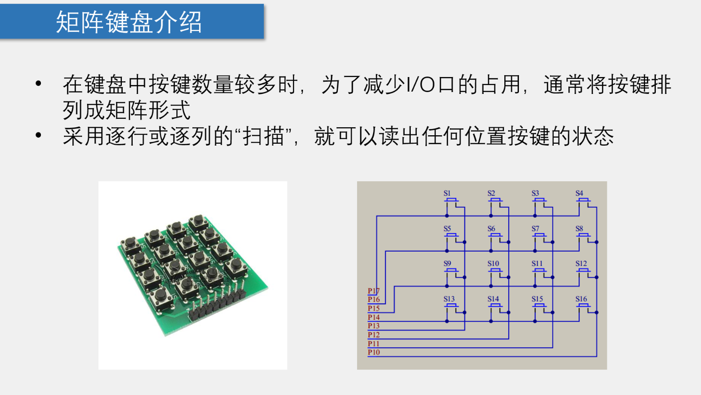

## 扫描


## 按行扫描
​ 如果是按行扫描，那么同一时间只有一行是0（P17-P14中只有一个为0），然后检测P13-P10，即可判断一行中哪个按键被按下
​ 但是不推荐在这个开发板逐行扫描，因为按行扫描P15会时高时低，而P15连接到步进电机，右边连接BZ，经过驱动器驱动会增加输出电流能力，连接到蜂鸣器上，这个开发板上BZ以一定频率高低变换时蜂鸣器会响。

## 按列扫描
​如果是按列扫描，那么同一时间只有一列是0（P13-P10中只有一个为0），然后检测P17-P14，即可判断一列中哪个按键被按下
按列扫描时下面四个口（P10-P13）同时只有一个口给0，扫描上面四个口即可按列判断哪个开关按下

## 单片机引脚的模式
这里有一点问题就是：本单片机是准双向口输出，每个口既能做输入也能做输出而不用重新配置口线输出状态。其实这样相当于单片机一个引脚输出高电平，直接与另一个为低电平的引脚相连接。不会短路吗？

单片机的处理方法是这样的：单片机内部 VCC 电源还附带一个下拉电阻。低电平的驱动力比高电平强，高电平直接接低电平就会被变为低电平，而不会短路。

## 按列逐行扫描矩阵键盘
`src/MatrixKey.c`整体赋值
```c
#include "REG52.H"
#include "Delay.H"

/**
 * @description: 按列扫描每一个按键，如果按下（低电平）则选中
 * @return {unsigned char} KeyNum 显示的值
 */
unsigned char MatrixKey(){

    unsigned char KeyNum = 0;

    // 先将P1所有bit置为1
    P1 = 0xFF;
    // 将P1寄存器的第四bit置为0
    P1 = 0xF7;// 扫描第一列
    if (P1 == 0x77) // 判断第一行是否按下
    {
        // 加入延时函数消除抖动
        Delay(20);
        // 判断是否松手，如果松手，则不需要加入延时函数消除抖动
        while (P1 == 0x77)
        {
            Delay(20);
            // 按下了矩阵按键S1，所以我们赋值为1
            KeyNum = 1;
        }
        
    }
    
    if (P1 == 0xB7) // 判断第二行是否按下
    {
        Delay(20);
        while (P1 == 0xB7)
        {
            Delay(20);
            // 按下了矩阵按键S5，所以我们赋值为5
            KeyNum = 5;
        }
        
    }
    if (P1 == 0xD7) // 判断第三行是否按下
    {
        Delay(20);
        while (P1 == 0xD7)
        {
            Delay(20);
            // 按下了矩阵按键S9，所以我们赋值为9
            KeyNum = 9;
        }
        
    }
    if (P1 == 0xE7) // 判断第四行是否按下
    {
        Delay(20);
        while (P1 == 0xE7)
        {
            Delay(20);
            // 按下了矩阵按键S13，所以我们赋值为13
            KeyNum = 13;
        }
        
    }

    // 先将P1所有bit置为1
    P1 = 0xFF;
    P1 = 0xFB; // 扫描第二列
    if(P1 == 0x7B){Delay(20);while(P1 == 0x7B);Delay(20);KeyNum = 2;} // 判断第一行是否按下
    if(P1 == 0xBB){Delay(20);while(P1 == 0xBB);Delay(20);KeyNum = 6;} // 判断第二行是否按下
    if(P1 == 0xDB){Delay(20);while(P1 == 0xDB);Delay(20);KeyNum = 10;} // 判断第三行是否按下
    if(P1 == 0xEB){Delay(20);while(P1 == 0xEB);Delay(20);KeyNum = 14;} // 判断第四行是否按下

    // 先将P1所有bit置为1
    P1 = 0xFF;
    P1 = 0xFD; // 扫描第三列
    if(P1 == 0x7D){Delay(20);while(P1 == 0x7D);Delay(20);KeyNum = 3;} // 判断第一行是否按下
    if(P1 == 0xBD){Delay(20);while(P1 == 0xBD);Delay(20);KeyNum = 7;} // 判断第二行是否按下
    if(P1 == 0xDD){Delay(20);while(P1 == 0xDD);Delay(20);KeyNum = 11;} // 判断第三行是否按下
    if(P1 == 0xED){Delay(20);while(P1 == 0xED);Delay(20);KeyNum = 15;} // 判断第四行是否按下

    // 先将P1所有bit置为1
    P1 = 0xFF;
    P1 = 0xFE; // 扫描第四列
    if(P1 == 0x7E){Delay(20);while(P1 == 0x7E);Delay(20);KeyNum = 4;} // 判断第一行是否按下
    if(P1 == 0xBE){Delay(20);while(P1 == 0xBE);Delay(20);KeyNum = 8;} // 判断第二行是否按下
    if(P1 == 0xDE){Delay(20);while(P1 == 0xDE);Delay(20);KeyNum = 12;} // 判断第三行是否按下
    if(P1 == 0xEE){Delay(20);while(P1 == 0xEE);Delay(20);KeyNum = 16;} // 判断第四行是否按下
    
    return KeyNum;

}

```
`src/MatrixKey.c`局部赋值
```C
#include <REGX52.H>
#include "Delay.h"

/**
  * @brief  矩阵键盘读取按键键码
  * @param  无
  * @retval KeyNumber 按下按键的键码值
			如果按键按下不放，程序会停留在此函数，松手的一瞬间，返回按键键码，没有按键按下时，返回0
  */
unsigned char MatrixKey()
{
	unsigned char KeyNumber=0;
	
	P1=0xFF;
	P1_3=0;
	if(P1_7==0){Delay(20);while(P1_7==0);Delay(20);KeyNumber=1;}
	if(P1_6==0){Delay(20);while(P1_6==0);Delay(20);KeyNumber=5;}
	if(P1_5==0){Delay(20);while(P1_5==0);Delay(20);KeyNumber=9;}
	if(P1_4==0){Delay(20);while(P1_4==0);Delay(20);KeyNumber=13;}
	
	P1=0xFF;
	P1_2=0;
	if(P1_7==0){Delay(20);while(P1_7==0);Delay(20);KeyNumber=2;}
	if(P1_6==0){Delay(20);while(P1_6==0);Delay(20);KeyNumber=6;}
	if(P1_5==0){Delay(20);while(P1_5==0);Delay(20);KeyNumber=10;}
	if(P1_4==0){Delay(20);while(P1_4==0);Delay(20);KeyNumber=14;}
	
	P1=0xFF;
	P1_1=0;
	if(P1_7==0){Delay(20);while(P1_7==0);Delay(20);KeyNumber=3;}
	if(P1_6==0){Delay(20);while(P1_6==0);Delay(20);KeyNumber=7;}
	if(P1_5==0){Delay(20);while(P1_5==0);Delay(20);KeyNumber=11;}
	if(P1_4==0){Delay(20);while(P1_4==0);Delay(20);KeyNumber=15;}
	
	P1=0xFF;
	P1_0=0;
	if(P1_7==0){Delay(20);while(P1_7==0);Delay(20);KeyNumber=4;}
	if(P1_6==0){Delay(20);while(P1_6==0);Delay(20);KeyNumber=8;}
	if(P1_5==0){Delay(20);while(P1_5==0);Delay(20);KeyNumber=12;}
	if(P1_4==0){Delay(20);while(P1_4==0);Delay(20);KeyNumber=16;}
	
	return KeyNumber;
}
```
`src/MatrixKey.h`
```c
#ifndef __MATRIXKEY_H__
#define __MATRIXKEY_H__

unsigned char MatrixKey();

#endif
```
`src/main.c`
```c
#include <REGX52.H>
#include "Delay.h"		//包含Delay头文件
#include "LCD1602.h"	//包含LCD1602头文件
#include "MatrixKey.h"	//包含矩阵键盘头文件

unsigned char KeyNum;

void main()
{
	LCD_Init();							//LCD初始化
	LCD_ShowString(1,1,"MatrixKey:");	//LCD显示字符串
	while(1)
	{
		KeyNum=MatrixKey();				//获取矩阵键盘键码
		if(KeyNum)						//如果有按键按下
		{
			LCD_ShowNum(2,1,KeyNum,2);	//LCD显示键码
		}
	}
}
//如果删除了if，在开发板上怎么按都发现是0；其实显示过1，但很快到下一个循环，仔细看会发现LCD1602上的数字闪了一下
```