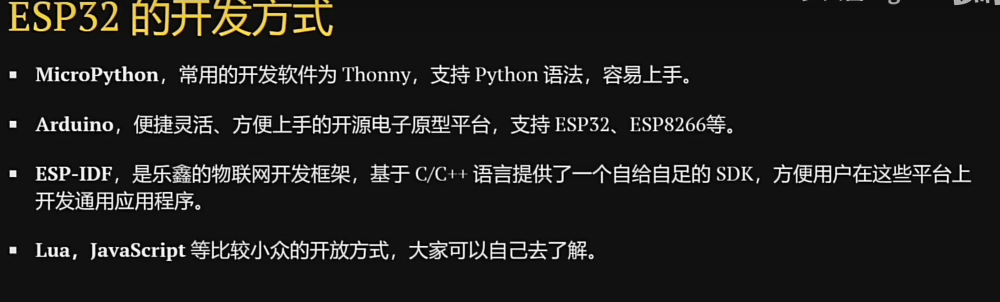
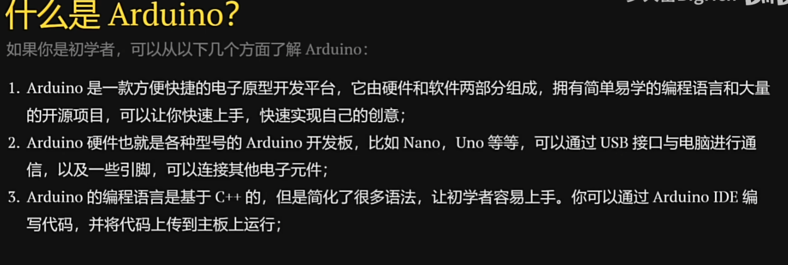

- [ESP-IDF和Arduino IDE的区别](https://www.bilibili.com/video/BV1ry4y1F7rw/?spm_id_from=333.337.search-card.all.click&vd_source=b3fd84988e8e921a37b4fa1da8d481db)

## 什么是Arduino

** 上述所说的都是安装开发工具后，在vscode里面适配插件使用